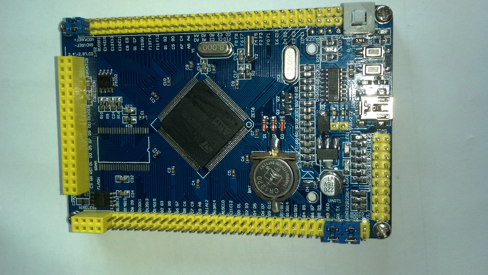
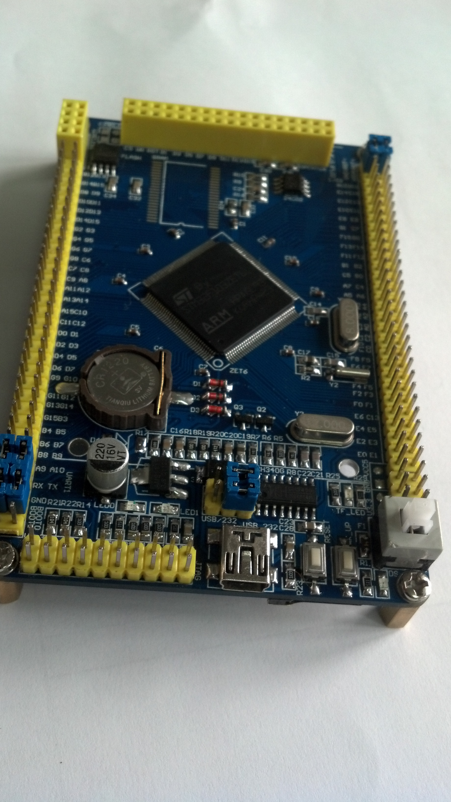
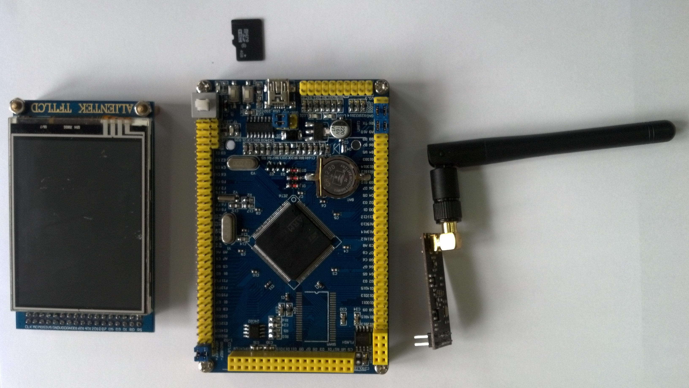
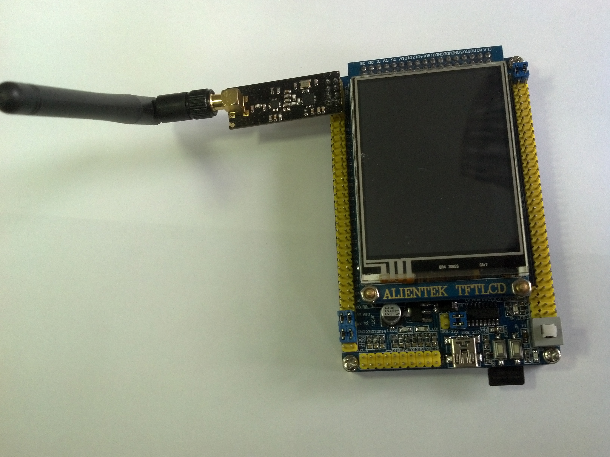
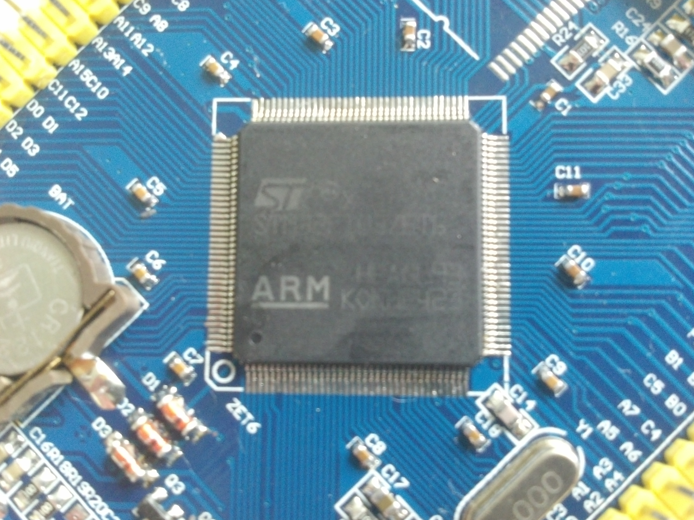
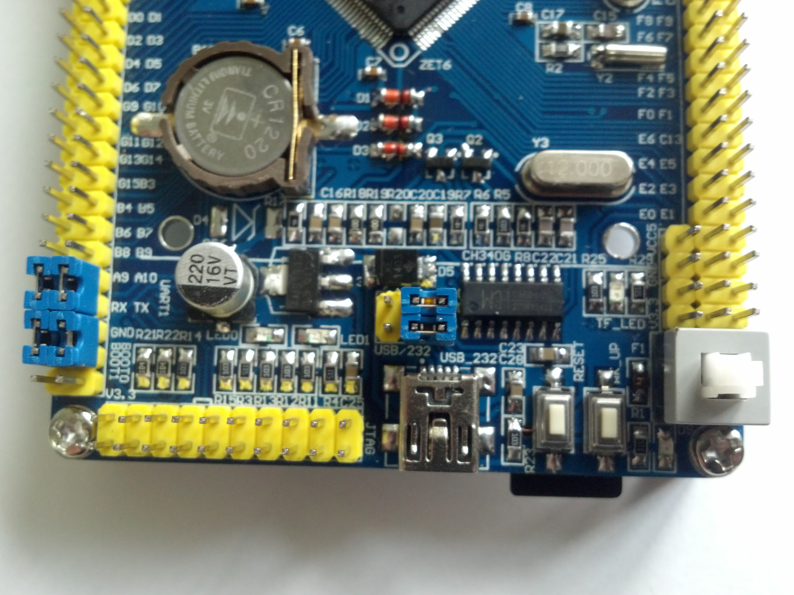
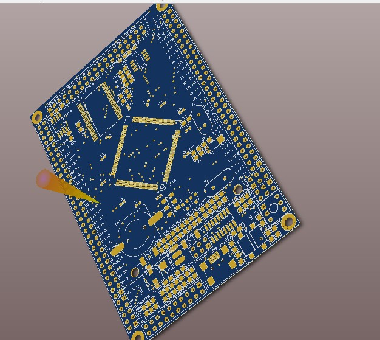
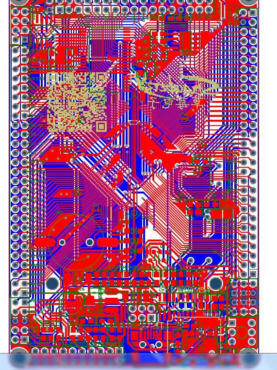
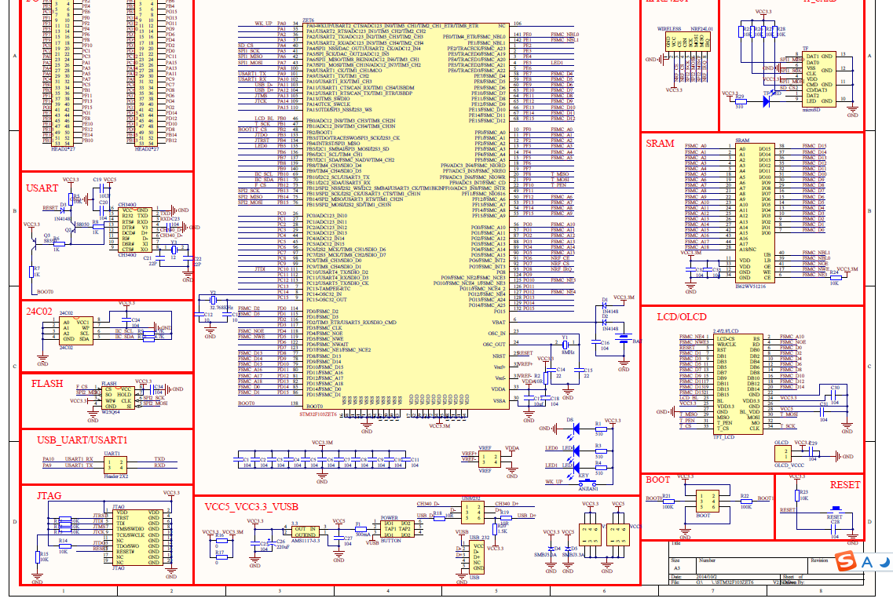

# STM32F103ZET6系统板V2

> 时间 2014年 11月

> 设计者：Haven 

- MCU: STM32F103ZET6

- 一键下载电路

- EEPROM 24c02

- W25Q64 外扩FLASH

- USB + URAT二合一mini接口

- JTAG接口

- nRF24L01接口

- microSD卡接口

- SRAM接口

- LCD接口

- BOOT设置

- 两个按键

- 两个LED

- 3.3V和5V向外供电接口

### 成品图

***

***

***

***

***

***

***

***

***

### 下载后Altium Designer 打开，我用的是AD10

#### 转载请注明出处